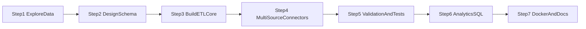
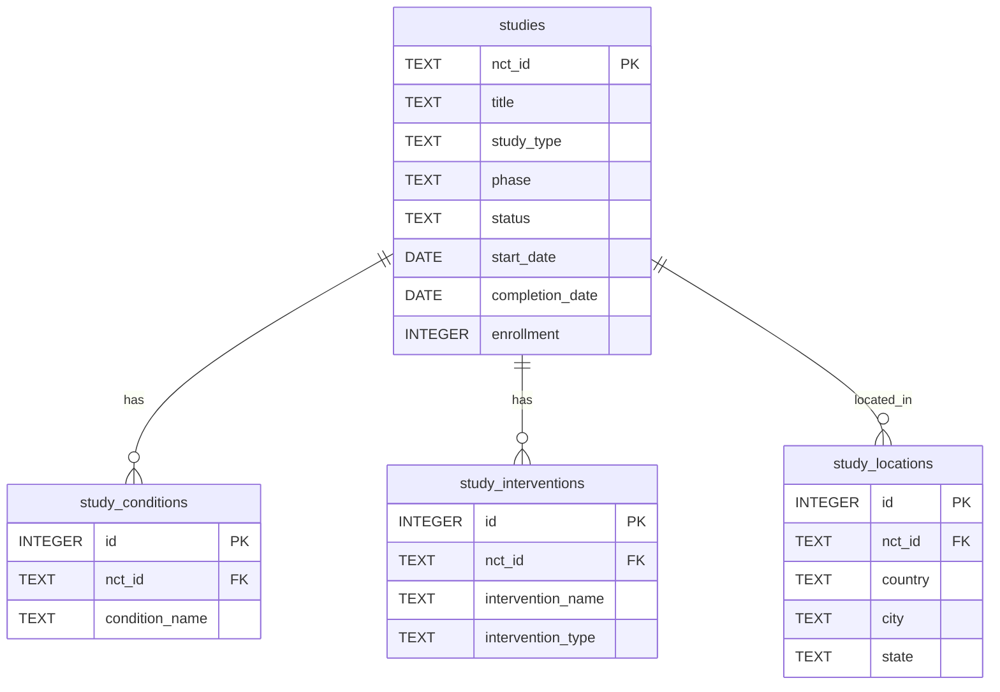
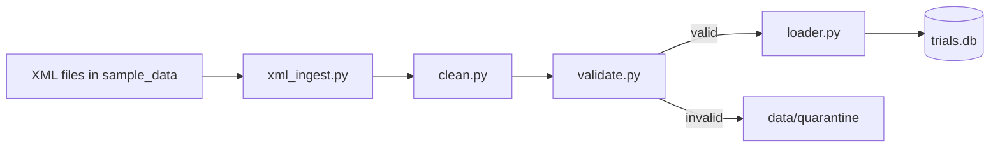
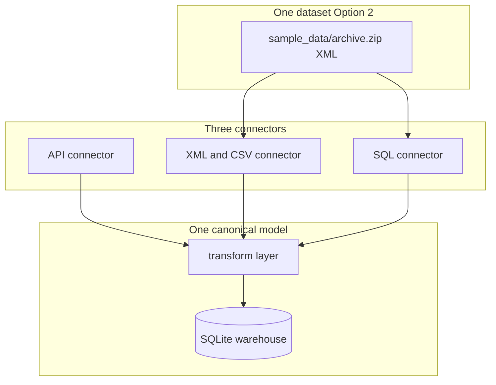
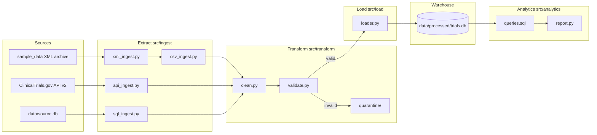

# Clinical Trial Data Pipeline — Project Roadmap & Implementation Plan

## Project overview

Build an end-to-end **Clinical Trial Data Pipeline** for the DE Technical Challenge: ingest trial data from multiple source types, validate and normalize it, store it in a relational database, and run analytical queries that answer business questions about enrollment, conditions, interventions, geography, and study timelines.

**Goal for reviewers:** Show clean Python, solid SQL, pipeline design thinking, Docker readiness, tests, and clear documentation — not a perfect production system.

**Strategy:** Extend the existing starter code in this repo. Ship a thin but complete vertical slice first, then layer on connectors, validation, and docs.

---

## Primary dataset (Option 2)

| Item | Detail |
|------|--------|
| **Challenge option** | Option 2 — Alternative Clinical Trials: All Clinical Trials |
| **Kaggle link** | [skylord/all-clinical-trials](https://www.kaggle.com/datasets/skylord/all-clinical-trials) |
| **What you have in repo** | `sample_data/archive.zip.download/archive.zip` |
| **Format on disk** | ZIP containing **103,509 ClinicalTrials.gov XML files** (~2.8 GB), one file per study (e.g. `NCT0000xxxx/NCT00000102.xml`) |
| **Registry** | U.S. ClinicalTrials.gov — comprehensive public trial registry |
| **Snapshot date** | May 2020 (from XML metadata) |

### Note on format

Kaggle describes Option 2 as a **single CSV** for ease of use. Your download is the **bulk XML export** of the same registry. The implementation treats XML as the **primary raw format** and generates a **CSV subset** from it for fast dev, tests, and the CSV connector demo. Document this clearly in the README.

### Data layout (target)

```
sample_data/
  archive.zip.download/archive.zip   # your Kaggle download — do NOT commit
  extracted/                         # unzipped XML — gitignored
  trials_subset.csv                  # ~500 rows exported for dev/tests — commit small file
tests/fixtures/
  NCT00000102.xml                    # 1–2 sample XML files for unit tests — commit

data/
  processed/trials.db                # pipeline warehouse (gitignored)
  source.db                          # staging DB for SQL connector (gitignored)
  quarantine/                        # rejected records (gitignored)
```

### Processing scope

| Environment | Records | Why |
|-------------|---------|-----|
| Unit tests | 1–5 XML files | Fast, deterministic |
| Local dev | 500 studies (`MAX_STUDIES=500`) | Iterate quickly |
| Docker demo | 500–1,000 studies | Reviewer runs in < 2 min |
| Full load (optional) | All 103,509 | Document as future improvement |

---

## High-level roadmap



| Step | Name | Time | Deliverable |
|------|------|------|-------------|
| 1 | Explore data | 30 min | Understand XML fields, list quality issues |
| 2 | Design schema | 30 min | `schema.sql`, ER diagram, field mapping |
| 3 | Build ETL core | 60 min | parse → clean → validate → load working on subset |
| 4 | Multi-source connectors | 45 min | XML/CSV + API + SQL into same schema |
| 5 | Validation & tests | 45 min | Quarantine, pytest, fixtures |
| 6 | Analytics SQL | 30 min | 5 business queries + report |
| 7 | Docker & docs | 30 min | Dockerfile, README, bonus Q&A |

**Total:** ~4 hours

---

## Implementation steps with methodology rationale

Each step below explains **what to do**, **how to do it**, and **why this approach was chosen**.

---

### Step 1 — Explore the data in `sample_data`

**What to do**

1. Unzip `sample_data/archive.zip.download/archive.zip` → `sample_data/extracted/`
2. Open 3–5 XML files; note fields for studies, conditions, interventions, locations, dates
3. Record 3–5 data quality issues (missing dates, inconsistent phases, multi-value nodes)
4. Add `.gitignore` for `extracted/`, large zips, and `*.db`

**How**

- Use Python `xml.etree.ElementTree` or `lxml` to inspect structure
- Log null rates and date format examples in README

**Why this methodology**

- **Schema design must follow the data**, not the other way around. Exploring first avoids rework.
- The XML archive is nested and multi-valued (multiple `<condition>`, `<intervention>`, `<location>` per study). You need to see this before choosing normalization.
- Documenting quality issues upfront shows production awareness — the challenge expects real-world messiness.

**Key fields found in your XML**

| XML element | Example value |
|-------------|---------------|
| `nct_id` | `NCT00000102` |
| `brief_title` | Study title |
| `study_type` | `Interventional` |
| `phase` | `Phase 1/Phase 2` |
| `overall_status` | `Completed` |
| `start_date` | `February 1994` |
| `condition` | One or more condition names |
| `intervention` | Drug name + type |
| `location` | City, state, country |

---

### Step 2 — Design normalized database schema

**What to do**

1. Create `src/db/schema.sql` with 4 tables: `studies`, `study_conditions`, `study_interventions`, `study_locations`
2. Add indexes on columns used in analytics (`phase`, `status`, `country`, `condition_name`)
3. Create `src/db/connection.py` and `src/config.py`

**How**



**Why this methodology**

- **Normalization (3NF-lite):** The flat single-table approach in the current `src/ingest.py` duplicates study metadata when a trial has multiple conditions or sites. Splitting into child tables avoids duplication and makes analytics queries correct.
- **SQLite for prototype:** Zero setup for reviewers; no Docker Compose database service needed. Postgres migration is documented as a future step — standard DE trade-off for take-home challenges.
- **Indexes on analytics columns:** The 5 required analytics questions filter/group by `phase`, `status`, `country`, and `condition_name`. Indexing these shows SQL proficiency without over-engineering.

**Load strategy:** Upsert on `studies.nct_id`; replace child rows per study on reload. Idempotent runs are expected in production pipelines.

---

### Step 3 — Build the ETL core (Extract → Transform → Load)

**What to do**

1. `src/ingest/xml_ingest.py` — parse XML files → pandas DataFrames (studies + child tables)
2. `src/transform/clean.py` — normalize dates, phases, strip whitespace
3. `src/transform/validate.py` — split valid vs invalid rows; write quarantine files
4. `src/load/loader.py` — bulk upsert into SQLite (no row-by-row `iterrows()`)
5. `src/pipeline.py` — orchestrate steps with logging
6. Export `sample_data/trials_subset.csv` (500 rows) from parsed XML for fast reruns

**How**



**Why this methodology**

- **Layered ETL (not one big script):** Separating extract, transform, and load matches how production pipelines are structured. Reviewers assess modularity and scalability thinking.
- **XML as primary extractor:** Your data lives as XML in `sample_data`. Parsing XML directly is the honest path; exporting CSV is a derived artifact for speed and connector demo.
- **Bulk load over `iterrows()`:** The current starter uses slow row-by-row inserts. Bulk `executemany` or `pandas.to_sql` is faster and shows you know performance basics.
- **Quarantine invalid rows:** Silent `except: continue` (current code) hides data loss. Writing rejects to `data/quarantine/` is a production pattern the challenge rewards.
- **Subset export (`trials_subset.csv`):** Re-parsing 103k XML files on every test run is impractical. A small committed CSV keeps tests fast and gives reviewers a quick path to verify CSV ingest.

---

### Step 4 — Multi-source ingestion (one dataset, three connectors)

**What to do**

The challenge requires CSV, JSON API, and SQL ingestion. You use **one dataset** (Option 2) and three **connectors**:

| Connector | File | Input | Purpose |
|-----------|------|-------|---------|
| XML/CSV (primary) | `xml_ingest.py`, `csv_ingest.py` | `sample_data` XML or exported CSV | Grounded in your Kaggle download |
| JSON API | `api_ingest.py` | ClinicalTrials.gov API v2 | Live fetch; same canonical schema |
| SQL | `sql_ingest.py` | `data/source.db` | Staging copy of exported CSV |

Update `src/run_pipeline.py` with `--source xml|csv|api|sql|all`.

**How**



**Why this methodology**

- **ELT pattern:** All sources produce the same DataFrame shape → same transform → same load. This is how real platforms integrate heterogeneous upstreams without maintaining separate pipelines per source.
- **Not three different datasets:** The challenge says choose ONE verified dataset. Connectors demonstrate *capability*, not data diversity.
- **API as supplemental live sample:** Fetching 100–500 studies from ClinicalTrials.gov v2 shows JSON parsing and pagination without depending on network for the full pipeline demo.
- **SQL staging DB:** Loading exported CSV into `data/source.db` simulates reading from an upstream operational database — common in consultancy engagements where CSV exports come from client SQL systems.

---

### Step 5 — Validation, error handling, and tests

**What to do**

1. Implement validation rules in `src/transform/validate.py`
2. Write tests: `test_xml_ingest.py`, `test_validate.py`, `test_ingest_csv.py`, `test_analytics.py`
3. Add `tests/fixtures/` with 1–2 sample XML files copied from archive
4. Run `pytest -q`

**Validation rules**

| Rule | Action |
|------|--------|
| Missing `nct_id` or `title` | Reject → quarantine |
| Invalid `nct_id` format | Reject or warn |
| Unparseable dates | Set NULL + log |
| Unknown phase | Map to `Unknown` |
| Duplicate `nct_id` | Keep latest |
| Empty condition/intervention | Skip child row only |

**Why this methodology**

- **Tests on fixtures, not full archive:** Unit tests must be fast and deterministic. Two small XML files in `tests/fixtures/` are enough to prove parsing and validation logic.
- **Explicit validation module:** Data quality is a scored dimension. A dedicated `validate.py` with quarantine output is stronger than inline checks scattered in ingest code.
- **Edge case coverage:** Bad dates, missing required fields, and duplicate IDs are exactly what appear in the 103k XML archive.

---

### Step 6 — Analytics and reporting

**What to do**

1. Create `src/analytics/queries.sql` with 5 queries
2. Create `src/analytics/report.py` to run queries and print results after pipeline completes

**Required analytics**

| # | Question | SQL idea |
|---|----------|----------|
| 1 | Trials by study type and phase | `GROUP BY study_type, phase` on `studies` |
| 2 | Most common conditions | Join `study_conditions`, top 10 by count |
| 3 | Interventions with highest completion rates | Join interventions + studies; `completed / total` per intervention |
| 4 | Geographic distribution | `GROUP BY country` on `study_locations` |
| 5 | Timeline / duration analysis | Date diff avg by `phase` where start and completion exist |

**Completion rate formula (document in README):**

```
completion_rate = COUNT(studies where status='Completed' AND has intervention X)
                  / COUNT(studies with intervention X)
```

**Why this methodology**

- **SQL in separate `.sql` file:** Shows SQL proficiency as a first-class artifact, not buried in Python strings. Reviewers can read queries directly.
- **Normalized schema enables correct analytics:** "Most common conditions" requires a `study_conditions` table — impossible to answer accurately from a flat denormalized CSV column with semicolon-separated values.
- **Report module as thin wrapper:** Keeps analytics logic in SQL where it belongs; Python only executes and formats output.

---

### Step 7 — Docker, README, and submission

**What to do**

1. Add `Dockerfile`, `docker-compose.yml`, `.dockerignore`
2. Expand `README.md` with architecture diagram, setup, design decisions, trade-offs, time log, bonus Q&A
3. Verify: `docker compose up --build` runs pipeline on subset and prints analytics
4. Push to GitHub; invite `MIGx-user` if private repo

**Why this methodology**

- **Docker = reproducibility:** Reviewers run one command. No "works on my machine" risk.
- **README is part of the score:** Architecture diagram, trade-offs, and bonus answers are explicit evaluation criteria in the challenge PDF.
- **Capped subset in Docker:** Default `MAX_STUDIES=500` keeps container startup fast for reviewers.

---

## End-to-end pipeline architecture



---

## Target code structure

```
src/
  config.py
  pipeline.py
  run_pipeline.py              # CLI: --source xml|csv|api|sql|all
  db/
    schema.sql
    connection.py
  ingest/
    xml_ingest.py                # PRIMARY — reads sample_data XML
    csv_ingest.py                # reads trials_subset.csv
    api_ingest.py                # ClinicalTrials.gov API v2
    sql_ingest.py                # reads data/source.db
  transform/
    clean.py
    validate.py
  load/
    loader.py
  analytics/
    queries.sql
    report.py
tests/
  fixtures/                      # sample XML files from archive
  test_xml_ingest.py
  test_validate.py
  test_ingest_csv.py
  test_analytics.py
sample_data/
  archive.zip.download/archive.zip
  trials_subset.csv              # generated once, committed
Dockerfile
docker-compose.yml
README.md
```

---

## XML → schema field mapping

| XML path | Target table.column | Notes |
|----------|---------------------|-------|
| `id_info/nct_id` | `studies.nct_id` | Primary key |
| `brief_title` | `studies.title` | Required |
| `study_type` | `studies.study_type` | Interventional / Observational |
| `phase` | `studies.phase` | Normalize e.g. `Phase 1/Phase 2` |
| `overall_status` | `studies.status` | Completed, Recruiting, etc. |
| `start_date` | `studies.start_date` | Parse text dates to ISO |
| `completion_date` | `studies.completion_date` | Often missing |
| `enrollment` | `studies.enrollment` | Integer |
| `condition` (repeatable) | `study_conditions.condition_name` | One row per value |
| `intervention/intervention_name` | `study_interventions.intervention_name` | One row per block |
| `intervention/intervention_type` | `study_interventions.intervention_type` | Drug, Procedure, etc. |
| `location/.../country` | `study_locations.country` | Geographic analytics |
| `location/.../city` | `study_locations.city` | |
| `location/.../state` | `study_locations.state` | |

---

## Expected data quality issues (document in README)

1. **Inconsistent date formats** — `February 1994` vs `2020-01-01`; anticipated vs actual dates
2. **Missing completion dates** — common in older or ongoing studies
3. **Multi-valued XML nodes** — multiple conditions, interventions, locations per study
4. **Phase inconsistencies** — `Phase 1/Phase 2`, `N/A`, blank for observational studies
5. **Malformed XML** — occasional parse failures; route to quarantine

---

## Implementation checklist

### Phase 0 — Data prep
- [ ] Unzip `sample_data/archive.zip.download/archive.zip`
- [ ] Add `.gitignore` (extracted/, large zips, *.db, data/raw/)
- [ ] Parse 1 XML file; confirm field mapping
- [ ] Export `sample_data/trials_subset.csv` (500 rows)
- [ ] Copy sample XML to `tests/fixtures/`

### Phase 1 — Schema & config
- [ ] `src/db/schema.sql` (4 tables + indexes)
- [ ] `src/db/connection.py`
- [ ] `src/config.py` (paths, `MAX_STUDIES`)

### Phase 2 — ETL core
- [ ] `src/ingest/xml_ingest.py`
- [ ] `src/transform/clean.py`
- [ ] `src/transform/validate.py`
- [ ] `src/load/loader.py`
- [ ] `src/pipeline.py`

### Phase 3 — Multi-source
- [ ] `src/ingest/csv_ingest.py`
- [ ] `src/ingest/api_ingest.py`
- [ ] `src/ingest/sql_ingest.py`
- [ ] `src/run_pipeline.py` with `--source` flag

### Phase 4 — Tests
- [ ] Validation + quarantine
- [ ] 4+ pytest files; `pytest -q` passes

### Phase 5 — Analytics
- [ ] `src/analytics/queries.sql` (5 queries)
- [ ] `src/analytics/report.py`

### Phase 6 — Ship
- [ ] Dockerfile + docker-compose.yml
- [ ] README (architecture, setup, trade-offs, bonus Q&A)
- [ ] `docker compose up --build` smoke test

---

## Current state vs. target

| Area | Today | After implementation |
|------|-------|----------------------|
| Data | `archive.zip` in `sample_data`, unused | XML parsed; subset CSV exported |
| Ingest | Flat CSV in `src/ingest.py` | XML + CSV + API + SQL connectors |
| Schema | Single `studies` table | 4 normalized tables |
| Validation | Minimal | Quarantine + logging |
| Analytics | 2 queries | 5 required queries |
| Docker | None | Full containerized run |
| Tests | 1 test | 4+ tests with fixtures |

---

## Priority if time runs out

| Priority | Keep |
|----------|------|
| **Must have** | XML/CSV ingest, normalized schema, 3+ analytics, Docker, README |
| **Should have** | API ingest, quarantine, 5 tests |
| **Nice to have** | Full 103k load, Postgres, Streamlit |

---

## README template (dataset section)

```markdown
**Primary dataset:** Option 2 — [All Clinical Trials (Kaggle)](https://www.kaggle.com/datasets/skylord/all-clinical-trials)

**Local copy:** `sample_data/archive.zip.download/archive.zip` — ClinicalTrials.gov XML bulk
export (~103k studies, May 2020 snapshot).

**Multi-source ingestion:** XML/CSV (primary, from Kaggle download), JSON API (live sample from
ClinicalTrials.gov v2), and SQL (staging DB) all load into one normalized SQLite schema.
```

---

## Bonus questions (for README)

1. **Scalability (100x):** Parallel XML parsing, batch partitions, Postgres/warehouse, object storage for raw zip, incremental API sync
2. **Data quality:** NCT ID regex, phase/status enums, start ≤ completion, referential integrity, parse-error quarantine
3. **GxP compliance:** Audit trails, IQ/OQ/PQ validation, immutable raw zone, access control, change management
4. **Monitoring:** Row counts, quarantine rate, ingest duration, freshness SLA alerts
5. **Security:** Encryption at rest/transit, RBAC, secrets in env vars; this public registry has no patient PHI

---

## What makes this submission strong

- **Option 2 explicitly chosen** with Kaggle link and honest note about XML format in `sample_data`
- **Methodology explained** — normalized schema, ELT, quarantine, subset processing
- **One canonical model**, multiple connectors — correct interpretation of "multi-source"
- **Runnable in one command** locally and via Docker
- **SQL that answers business questions**, not just `SELECT *`
