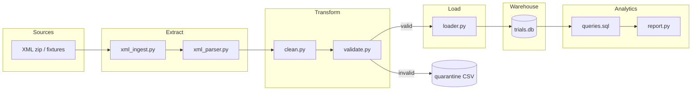

# Clinical Trial Data Pipeline

Junior-level prototype for the **DE Technical Challenge**.

**Status:** Core pipeline complete (exploration → schema → ETL → validation → analytics → Docker). Multi-source connectors (CSV/API/SQL) planned as optional enhancement.

**Primary dataset:** [Option 2 — All Clinical Trials (Kaggle)](https://www.kaggle.com/datasets/skylord/all-clinical-trials)

**Local data:** `sample_data/archive.zip.download/archive.zip` (~103,509 ClinicalTrials.gov XML files, May 2020 snapshot). Not committed to git — download separately from Kaggle.

---

## Quick start (local)

```bash
python3 -m venv .venv
source .venv/bin/activate
pip install -r requirements.txt

# Explore sample XML
python src/explore_data.py --sample-size 300

# Create DB + run ETL (requires zip, or use --fixtures)
python -m src.init_db
python -m src.run_pipeline --max-studies 500 --report
python -m src.run_pipeline --fixtures --report   # no zip needed (2 studies)

# Tests
pytest -q
```

---

## Quick start (Docker)

One command — runs tests, loads trials, and prints the analytics report:

```bash
docker compose up --build
```

**Set how many trials to load** (when the zip is mounted):

```bash
MAX_STUDIES=100 docker compose up --build
```

Or edit `MAX_STUDIES` in `docker-compose.yml`:

```yaml
environment:
  MAX_STUDIES: ${MAX_STUDIES:-500}   # change 500 to whatever you want
```

- **Without zip:** uses `tests/fixtures/` (2 sample studies) automatically.
- **With zip:** uncomment the volume in `docker-compose.yml`:

```yaml
volumes:
  - ./sample_data/archive.zip.download:/app/sample_data/archive.zip.download:ro
```

---

## Architecture



**Flow:** XML → parse → clean → validate → load → SQLite → SQL analytics report.

| Layer | Files | Role |
|-------|-------|------|
| Config | `src/config.py` | Paths, `MAX_STUDIES` cap |
| Extract | `src/ingest/` | Read zip/fixtures, parse XML |
| Transform | `src/transform/` | Normalize dates/phases; reject bad rows |
| Load | `src/load/loader.py` | Upsert into 4 normalized tables |
| Orchestrate | `src/pipeline.py`, `run_pipeline.py` | E-T-L runner + CLI |
| Analytics | `src/analytics/` | 5 business SQL queries + report |
| Database | `src/db/schema.sql` | DDL, indexes, foreign keys |

---

## Project status

| Phase | Description | Status |
|-------|-------------|--------|
| 0 | Data exploration | **Done** |
| 1 | Schema design | **Done** |
| 2 | ETL (parse, clean, load) | **Done** |
| 3 | Multi-source (CSV, API, SQL) | Planned |
| 4 | Validation & tests | **Done** |
| 5 | Analytics SQL | **Done** |
| 6 | Docker & docs | **Done** |

See [STORY.md](STORY.md) (interview narrative), [PLAN.md](PLAN.md), [IMPLEMENTATION.md](IMPLEMENTATION.md), and [ppt.md](ppt.md) for phase-by-phase notes.

---

## Database schema

Four normalized tables (one study → many conditions/interventions/locations):

| Table | Purpose |
|-------|---------|
| `studies` | One row per trial (`nct_id` PK) |
| `study_conditions` | Diseases/conditions per trial |
| `study_interventions` | Drugs/treatments per trial |
| `study_locations` | Cities/countries per trial |

```bash
python -m src.init_db
sqlite3 data/processed/trials.db ".tables"
```

---

## ETL & validation

```
XML  →  Extract  →  Clean  →  Validate  →  Load  →  trials.db
                              ↓
                    data/quarantine/rejected_studies.csv
```

| Rule | Action |
|------|--------|
| Missing `nct_id` or `title` | Reject → quarantine |
| Invalid `nct_id` format | Reject |
| `start_date` after `completion_date` | Reject |
| Malformed XML | Reject (parse error) |
| Empty phase | Map to `Unknown` |
| Bad dates | Set NULL + log |
| Duplicate `nct_id` | Keep latest |

```bash
pytest -q   # 22 tests
```

---

## Analytics (5 required queries)

| # | Question | File |
|---|----------|------|
| 1 | Trials by study type and phase | `queries.sql` |
| 2 | Most common conditions (top 10) | |
| 3 | Interventions with highest completion rates | |
| 4 | Geographic distribution | |
| 5 | Average study duration by phase | |

**Completion rate formula:**

```
completion_rate = COUNT(studies where status='Completed' AND has intervention X)
                  / COUNT(studies with intervention X)
```

```bash
python -m src.analytics.report
python -m src.run_pipeline --max-studies 500 --report
```

---

## Design decisions & trade-offs

| Decision | Choice | Trade-off |
|----------|--------|-----------|
| Dataset | Option 2 — All Clinical Trials | Large archive; we cap at `MAX_STUDIES=500` for dev/Docker speed |
| Raw format | XML bulk (actual Kaggle download) | Harder than CSV but matches real ClinicalTrials.gov exports |
| Schema | 4 normalized tables | More joins than one flat table, but correct counts for multi-condition trials |
| Database | SQLite | Zero setup for reviewers; Postgres would scale better in production |
| Orchestration | Python CLI | No Airflow — simpler for a time-boxed challenge |
| Quarantine | CSV file for rejects | Easy to inspect; not a full dead-letter queue service |
| Docker default | Fixtures if no zip | Works without 2.8 GB download; mount zip for full subset load |

---

## Time log (approximate)

| Phase | Work | Time |
|-------|------|------|
| 0 | Data exploration, fixtures, findings | ~1 h |
| 1 | Schema design, init_db, tests | ~45 min |
| 2 | ETL modules + pipeline orchestrator | ~1 h |
| 4 | Validation rules, quarantine, 22 tests | ~45 min |
| 5 | 5 SQL queries + report module | ~30 min |
| 6 | Docker, README expansion | ~30 min |
| **Total** | | **~4 h** |

---

## Bonus Q&A (challenge follow-ups)

**1. How would you scale this 100x?**  
Parallelize XML parsing (multiprocessing), partition by NCT prefix, move warehouse to Postgres or Snowflake, store raw zip in S3, incremental API sync for updates instead of full bulk reload.

**2. How do you ensure data quality?**  
NCT ID regex validation, required fields, start ≤ completion check, parse-error quarantine, empty child-row filtering, duplicate `nct_id` handling, and pytest on fixture + bad-data files.

**3. What about GxP / regulated environments?**  
Add audit trails (who loaded what, when), validated ETL (IQ/OQ/PQ), immutable raw landing zone, RBAC on DB, change control on schema migrations. This public registry has no patient PHI.

**4. How would you monitor the pipeline?**  
Log row counts per stage, quarantine rate, ingest duration, alert if study count drops vs prior run, freshness SLA on API source.

**5. Security considerations?**  
Encrypt data at rest/transit in production, secrets via env vars (not in git), least-privilege DB access. ClinicalTrials.gov public data — no PHI in this dataset.

---

## Repository structure

```
src/
  explore_data.py
  config.py
  init_db.py
  pipeline.py
  run_pipeline.py
  ingest/          xml_parser.py, xml_ingest.py
  transform/       clean.py, validate.py
  load/            loader.py
  analytics/       queries.sql, report.py
  db/              schema.sql, connection.py
tests/
  fixtures/        good XML samples
  fixtures_validation/   bad XML for validation tests
docker/
  entrypoint.sh
Dockerfile
docker-compose.yml
```

---

## References

- Dataset: https://www.kaggle.com/datasets/skylord/all-clinical-trials
- ClinicalTrials.gov: https://clinicaltrials.gov
- Reviewer GitHub (if private repo): `MIGx-user`
