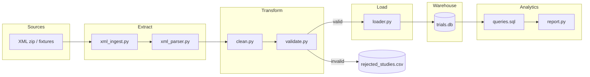

# Clinical Trial Data Pipeline

End-to-end ETL pipeline for the **DE Technical Challenge**: ingest ClinicalTrials.gov XML, validate and clean records, load into a normalized SQLite warehouse, and run five analytics queries.

**Dataset:** [Option 2 — All Clinical Trials (Kaggle)](https://www.kaggle.com/datasets/skylord/all-clinical-trials)  
**Local data:** `sample_data/archive.zip.download/archive.zip` (~103,509 XML files, ~2.8 GB, May 2020 snapshot). Not in git — download from Kaggle separately.

**Status:** Core pipeline complete (exploration → schema → ETL → validation → analytics → Docker). Multi-source connectors (CSV/API/SQL) are a planned optional enhancement.

---

## Project overview

This project turns raw clinical trial XML into queryable analytics. Each study is one XML file with repeatable child elements (conditions, interventions, locations). The pipeline:

1. **Extracts** XML from a zip archive or test fixtures
2. **Transforms** data — normalizes dates/phases, validates required fields
3. **Loads** valid rows into four normalized SQLite tables
4. **Quarantines** invalid rows to a CSV for inspection
5. **Reports** five business SQL queries (type/phase, conditions, completion rates, geography, duration)

The design favors **clarity and reproducibility** over production scale. SQLite, a Python CLI, and Docker make it easy for reviewers to run without extra infrastructure.

---

## Architecture



**End-to-end flow:**

```
XML zip / fixtures
  → EXTRACT (parse XML)
  → TRANSFORM (clean + validate → quarantine if bad)
  → LOAD (SQLite, 4 tables)
  → ANALYTICS (5 SQL queries)
```

| Layer | Key files | Role |
|-------|-----------|------|
| Config | `src/config.py` | Paths, `MAX_STUDIES` cap |
| Extract | `src/ingest/` | Read zip/fixtures, parse XML |
| Transform | `src/transform/` | Normalize dates/phases; reject bad rows |
| Load | `src/load/loader.py` | Upsert into 4 normalized tables |
| Orchestrate | `src/pipeline.py`, `run_pipeline.py` | E-T-L runner + CLI |
| Analytics | `src/analytics/` | 5 business SQL queries + report |
| Database | `src/db/schema.sql` | DDL, indexes, foreign keys |

### Database schema

Four normalized tables — one study can have many conditions, interventions, and locations:

| Table | Purpose |
|-------|---------|
| `studies` | One row per trial (`nct_id` PK) |
| `study_conditions` | Diseases/conditions per trial |
| `study_interventions` | Drugs/treatments per trial |
| `study_locations` | Cities/countries per trial |

---

## Local setup

### Prerequisites

- Python 3.12+ (or 3.10+)
- `pip` and `venv`
- Optional: Docker Desktop for containerized runs
- Optional: Kaggle zip for full data load (~2.8 GB)

### 1. Clone and install

```bash
git clone <repo-url>
cd test_Coding_Challenge

python3 -m venv .venv
source .venv/bin/activate        # Windows: .venv\Scripts\activate
pip install -r requirements.txt
```

### 2. (Optional) Download the dataset

1. Download [All Clinical Trials](https://www.kaggle.com/datasets/skylord/all-clinical-trials) from Kaggle
2. Place the zip at: `sample_data/archive.zip.download/archive.zip`

Without the zip, use `--fixtures` (2 sample studies) — no download needed.

### 3. Explore the data

```bash
python src/explore_data.py --sample-size 300
```

Profiles a sample of XML files: missing fields, multi-value patterns, phases, date formats.

### 4. Initialize the database

```bash
python -m src.init_db
sqlite3 data/processed/trials.db ".tables"
```

### 5. Run the pipeline

```bash
# Quick demo — no zip required (2 fixture studies)
python -m src.run_pipeline --fixtures --report

# Load from zip (cap with --max-studies)
python -m src.run_pipeline --max-studies 500 --report
```

### 6. Run tests

```bash
pytest -q
```

### 7. Run analytics only

```bash
python -m src.analytics.report
```

---

## Docker setup

One command runs tests, loads trials, and prints the analytics report:

```bash
docker compose up --build
```

### What Docker does

1. Builds a Python 3.12 slim image (`Dockerfile`)
2. Runs `pytest` (controlled by `RUN_TESTS`, default `1`)
3. Loads trials from the zip if mounted; otherwise uses fixtures (2 studies)
4. Prints the analytics report
5. Persists `data/` (DB + quarantine) via a volume mount

### Configuration

| Variable | Default | Purpose |
|----------|---------|---------|
| `MAX_STUDIES` | `500` | How many XML files to load from zip |
| `RUN_TESTS` | `1` | Run `pytest` before ETL (`0` to skip) |

```bash
# Load 100 trials instead of 500
MAX_STUDIES=100 docker compose up --build

# Skip tests for faster iteration
RUN_TESTS=0 docker compose up --build
```

Or edit `docker-compose.yml`:

```yaml
environment:
  MAX_STUDIES: ${MAX_STUDIES:-500}
  RUN_TESTS: ${RUN_TESTS:-1}
```

### Mounting the Kaggle zip

Uncomment (or keep) the volume in `docker-compose.yml`:

```yaml
volumes:
  - ./data:/app/data
  - ./sample_data/archive.zip.download:/app/sample_data/archive.zip.download:ro
```

- **Without zip:** pipeline uses `tests/fixtures/` automatically
- **With zip:** loads up to `MAX_STUDIES` trials from the archive

---

## ETL and validation

```
XML  →  Extract  →  Clean  →  Validate  →  Load  →  trials.db
                              ↓
                    data/quarantine/rejected_studies.csv
```

| Rule | Action |
|------|--------|
| Missing `nct_id` or `title` | Reject → quarantine |
| Invalid `nct_id` format | Reject |
| `start_date` after `completion_date` | Reject |
| Malformed XML | Reject (parse error) |
| Empty phase | Map to `Unknown` |
| Bad dates | Set NULL + log warning |
| Duplicate `nct_id` | Keep latest |
| Empty child rows | Skip row only |

---

## Analytics (5 required queries)

| # | Question |
|---|----------|
| 1 | Trials by study type and phase |
| 2 | Most common conditions (top 10) |
| 3 | Interventions with highest completion rates |
| 4 | Geographic distribution |
| 5 | Average study duration by phase |

**Completion rate formula:**

```
completion_rate = COUNT(studies where status='Completed' AND has intervention X)
                  / COUNT(studies with intervention X)
```

Queries live in `src/analytics/queries.sql`; `report.py` runs them and prints formatted tables.

---

## Challenge follow-up questions

### 1. Scalability — How would you handle 100x more data volume?

- **Storage:** Move raw XML to S3 (or GCS) with lifecycle policies; partition by NCT prefix or ingest date
- **Processing:** Parallelize XML parsing (multiprocessing, Spark, or AWS Glue); batch inserts instead of row-by-row
- **Warehouse:** Migrate SQLite → Postgres or Snowflake with proper indexes and partitioning on `phase`, `status`, `country`
- **Ingestion:** Switch from full bulk reload to incremental API sync (ClinicalTrials.gov v2) using `last_update_posted_date`
- **Orchestration:** Airflow/Prefect DAGs with retry, backfill, and SLA monitoring

### 2. Data quality — What additional validation rules would you add?

- **Referential integrity:** Reject studies with zero conditions *and* zero interventions (likely incomplete parse)
- **Domain enums:** Whitelist `overall_status`, `study_type`, and `phase` values; flag unknowns for review
- **Date logic:** Reject future `start_date`; flag studies where `completion_date` is set but status is not `Completed`
- **Enrollment:** Range check (`enrollment` > 0 and < reasonable max); flag text values that failed parsing
- **Duplicates:** Detect near-duplicate titles across different NCT IDs
- **Automated checks:** Great Expectations suites on row counts, null rates, and distribution drift between runs

### 3. Compliance — GxP environment considerations

- **Audit trail:** Immutable log of who ran the pipeline, when, source version, and row counts in/out
- **Validated system:** IQ/OQ/PQ documentation for ETL; frozen requirements and test evidence
- **Change control:** Versioned schema migrations with approval workflow; no ad-hoc DDL in production
- **Data lineage:** Track raw → staging → warehouse with documented transformations
- **Access control:** RBAC on DB and object storage; separation of dev/staging/prod environments
- **Note:** ClinicalTrials.gov is a **public registry** — this dataset has no patient PHI, but production clinical systems would require 21 CFR Part 11 alignment, electronic signatures, and retention policies

### 4. Monitoring — How would you monitor this pipeline in production?

- **Metrics:** Row counts per stage (extracted, validated, loaded, quarantined), ingest duration, quarantine rate %
- **Alerts:** Study count drops >10% vs prior run; quarantine rate spikes; pipeline runtime exceeds SLA
- **Freshness:** Track `max(last_update_posted_date)` in warehouse vs source API
- **Logging:** Structured JSON logs (study ID, stage, error reason) shipped to ELK, Datadog, or CloudWatch
- **Dashboards:** Grafana/Datadog panels for throughput, error trends, and data freshness
- **Health checks:** Post-run reconciliation — source file count vs loaded study count

### 5. Security — Measures for sensitive clinical data

- **Encryption:** TLS in transit; AES-256 at rest for DB, object storage, and backups
- **Secrets:** API keys and DB credentials in a vault (AWS Secrets Manager, HashiCorp Vault) — never in git
- **Access:** Least-privilege IAM; role-based DB access; no shared service accounts
- **Network:** Private VPC, security groups, no public DB endpoints
- **Audit:** Access logs for who queried or exported data; tamper-evident audit tables
- **De-identification:** If PHI were present — tokenize patient IDs, strip direct identifiers, apply HIPAA Safe Harbor or Expert Determination
- **Note:** This project uses **public ClinicalTrials.gov data** with no PHI. Security controls above apply when handling real patient or sponsor-confidential data.

---

## Project structure

The repo is organized by **pipeline stage** — each folder has one job. Code flows top to bottom: config → ingest → transform → load → analytics.

```
test_Coding_Challenge/
│
├── src/                          # All application code
│   ├── config.py                 # Central paths (zip, DB, quarantine) + MAX_STUDIES
│   ├── explore_data.py           # Phase 0: profile XML sample before building ETL
│   ├── init_db.py                # Create trials.db from schema.sql
│   ├── pipeline.py               # E-T-L orchestrator (ties all steps together)
│   ├── run_pipeline.py           # CLI entry point (--fixtures, --max-studies, --report)
│   │
│   ├── ingest/                   # EXTRACT — read raw XML
│   │   ├── xml_ingest.py         # Read from zip or fixtures folder; catch parse errors
│   │   └── xml_parser.py         # Parse one XML file → study dict + child rows
│   │
│   ├── transform/                # TRANSFORM — clean and validate
│   │   ├── clean.py              # Normalize dates, phases, enrollment
│   │   └── validate.py           # Apply rules; split valid/invalid; write quarantine CSV
│   │
│   ├── load/                     # LOAD — write to database
│   │   └── loader.py             # Upsert studies; replace child rows per trial
│   │
│   ├── db/                       # Database layer
│   │   ├── schema.sql            # DDL: 4 tables, indexes, foreign keys
│   │   └── connection.py         # Open SQLite, run schema, helper queries
│   │
│   └── analytics/                # REPORT — business SQL
│       ├── queries.sql           # 5 required analytics queries
│       └── report.py             # Run queries against DB and print tables
│
├── tests/                        # pytest suite (22 tests)
│   ├── conftest.py               # Shared fixtures (temp DB, quarantine dir)
│   ├── fixtures/                 # 2 good XML studies (NCT00000102, NCT00000125)
│   ├── fixtures_validation/      # 4 bad XML files for edge-case tests
│   ├── test_schema.py            # Tables created, inserts work
│   ├── test_xml_parser.py        # XML → dict parsing
│   ├── test_xml_ingest.py        # Zip/folder read + parse error handling
│   ├── test_clean.py             # Date/phase normalization
│   ├── test_validate.py          # All validation rules + quarantine
│   ├── test_pipeline.py          # End-to-end ETL on fixtures
│   └── test_analytics.py         # Queries load and execute
│
├── data/                         # Generated at runtime (not committed)
│   ├── processed/
│   │   └── trials.db             # SQLite warehouse
│   └── quarantine/
│       └── rejected_studies.csv  # Rows that failed validation
│
├── sample_data/                  # External dataset (not in git)
│   └── archive.zip.download/
│       └── archive.zip           # Kaggle download (~103k XML files)
│
├── docker/
│   └── entrypoint.sh             # Container startup: tests → ETL → report
│
├── Dockerfile                    # Python 3.12 slim image
├── docker-compose.yml            # One-command run + volume mounts
├── requirements.txt              # Python dependencies
├── pytest.ini                    # pytest config (pythonpath)
│
├── README.md                     # This file — setup, architecture, Q&A
├── STORY.md                      # Interview narrative (method / rationale / results)
├── IMPLEMENTATION.md             # Phase-by-phase build notes
└── PLAN.md                       # Original project roadmap
```

### How the modules connect

```
run_pipeline.py  (CLI)
       │
       ▼
pipeline.py  (orchestrator)
       │
       ├── ingest/xml_ingest.py  ──►  ingest/xml_parser.py
       │         (read zip/fixtures)      (XML → Python dict)
       │
       ├── transform/clean.py    ──►  transform/validate.py
       │         (normalize fields)       (rules + quarantine CSV)
       │
       ├── load/loader.py       ──►  db/connection.py  ──►  trials.db
       │         (upsert rows)            (SQLite)
       │
       └── analytics/report.py  ──►  analytics/queries.sql
                 (print report)            (5 SQL queries)
```

| Folder / file | Pipeline stage | What it does |
|---------------|----------------|--------------|
| `src/config.py` | Config | Single place for paths and `MAX_STUDIES` — every module imports from here |
| `src/explore_data.py` | Exploration | Profiles XML before ETL; informed schema design |
| `src/ingest/` | Extract | Reads XML from zip or fixtures; parses into structured records |
| `src/transform/` | Transform | Cleans messy dates/phases; validates and quarantines bad rows |
| `src/load/` | Load | Writes valid records into 4 normalized SQLite tables |
| `src/db/` | Storage | Schema DDL and connection helpers |
| `src/analytics/` | Analytics | Runs the 5 business queries and prints results |
| `src/pipeline.py` | Orchestration | Calls extract → clean → validate → load in order |
| `src/run_pipeline.py` | CLI | User-facing commands (`--fixtures`, `--max-studies`, `--report`) |
| `tests/` | Quality | Fast unit tests on small fixtures — no 2.8 GB zip needed |
| `docker/` | Deployment | Reproducible one-command run for reviewers |

### Generated vs committed files

| Path | In git? | Notes |
|------|---------|-------|
| `src/`, `tests/`, `docker/` | Yes | Application code and tests |
| `data/processed/trials.db` | No | Created by `init_db` / pipeline |
| `data/quarantine/*.csv` | No | Created when validation rejects rows |
| `sample_data/archive.zip` | No | Download from Kaggle separately |
| `.venv/`, `__pycache__/` | No | Local dev artifacts |

---

## References

- Dataset: https://www.kaggle.com/datasets/skylord/all-clinical-trials
- ClinicalTrials.gov: https://clinicaltrials.gov
- ClinicalTrials.gov API v2: https://clinicaltrials.gov/data-api/api
